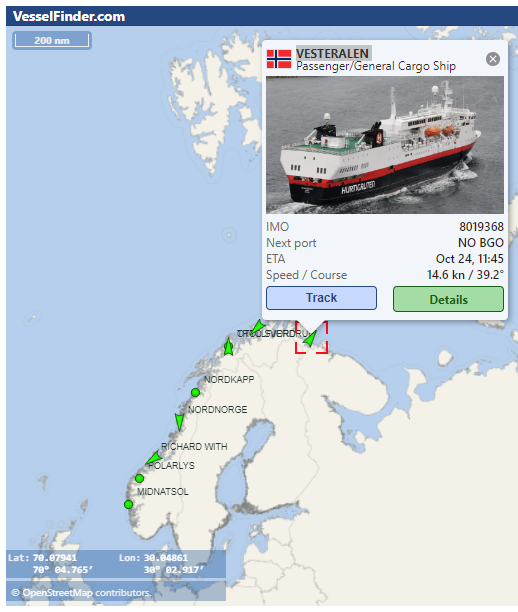

# Arctic Circle Crossing Predictor

Python tools to help predict when a vessel will cross the Arctic Circle.

## Background

On [Hurtigruten voyages](https://www.hurtigruten.com/en-gb/about-us/voyages/original) along the Norwegian coast, they celebrate crossing the [Arctic Circle](https://www.hurtigruten.com/en-gb/inspiration/coastal-highlights/arctic-circle) with a friendly competition. Whoever predicts the time the vessel will cross the Artctic Circle most accurately wins a prize - [ice water down the neck](https://youtu.be/TCo1N0wVk8g?feature=shared)!

I wondered if it would be possible to predict the crossing time using the vessel's location and data from previous voyages...

## Ship Locator

Hurtigruten share the location and route of all their ships:

The vessel location data is provided by [VesselFinder.com](https://www.vesselfinder.com/). With a [free account](https://www.vesselfinder.com/get-premium), you can track the position of ten vessels in near real-time and see their route / track for the previous 24 hours. With a [Premium account](https://www.vesselfinder.com/get-premium) you can track more ships for longer - ad-free.

The vessel data can be requested using the [API](https://api.vesselfinder.com/docs/). You need to purchase credits to use the API; these can be subscription-based (these are cheaper, you pay monthly, the credits last for one month) or on-demand (buy as many credits as you need, they last for 1 year). The [VESSELS](https://api.vesselfinder.com/docs/vessels.html) method provides the latest coordinates, speed, heading and other data for the vessel(s) you want to track. Each AIS enquiry will use one credit per vessel for terrestrial data, five credits for satellite data.

## Stage 1: Collecting Data For Vessels Crossing The Arctic Circle

Hurtigruten ships sail from Bergen at 20:30 each day. The [sailing plan](https://www.hurtigruten.com/en-gb/sail-plan) provides the departure and arrival times for each port. The [route map](https://www.norwegiancoastalcruises.com/route-map.pdf) shows the approximate route of the vessels. The [schedule](https://www.norwegiancoastalcruises.com/schedules/bergen-departures-2024.htm) shows which vessel sails on which day.

If we want to track the MS Polarlys (IMO 9107796) as it crosses the Arctic Circle, we know that:
* The MS Polarlys sails from Bergen on October 18th, October 29th, November 9th, November 20th 2024 etc..
* The Arctic Circle lies between Nesna and Ørnes
* The crossing will take place at approximately 9AM local time on Day 4 of the voyage
* If request the VESSELS API data each minute from 6AM to 10AM CET on October 21st, November 1st etc. we will capture the crossing

[Track_Vessel.py](./Track_Vessel.py) is a simple Python script which will track a vessel, or several vessels, for time windows defined in the code. The VESSELS JSON data is saved to individual files to preserve it. One file per request. Remember that requesting data for multiple vessels will use multiple credits.

Enjoy!
Paul
