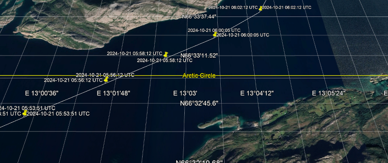
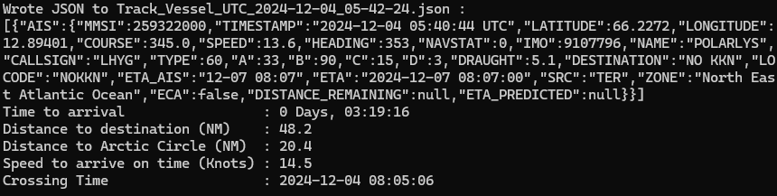

# Arctic Circle Crossing Predictor

Python tools to help predict when a vessel will cross the Arctic Circle.

## Background

On [Hurtigruten voyages](https://www.hurtigruten.com/en-gb/about-us/voyages/original) along the Norwegian coast, they celebrate crossing the [Arctic Circle](https://www.hurtigruten.com/en-gb/inspiration/coastal-highlights/arctic-circle) with a friendly competition. Whoever predicts the time the vessel will cross the Arctic Circle most accurately wins a prize - [ice water down the neck](https://youtu.be/TCo1N0wVk8g?feature=shared)!

I wondered if it would be possible to predict the crossing time more accurately using the vessel's location and route data from previous voyages...

## Ship Locator

Hurtigruten share the location and route of all their ships:

[](https://www.hurtigruten.com/en-gb/about-us/map)

The vessel location data is provided by [VesselFinder.com](https://www.vesselfinder.com/). With a [free account](https://www.vesselfinder.com/get-premium), you can track the position of ten vessels in near real-time and see their route / track for the previous 24 hours. With a [Premium account](https://www.vesselfinder.com/get-premium) you can track more ships for longer - ad-free.

The vessel data can also be requested using the [API](https://api.vesselfinder.com/docs/). You need to purchase credits to use the API; these can be subscription-based (these are cheaper, you pay monthly, the credits last for one month) or on-demand (buy as many credits as you need, they last for 1 year). The [VESSELS](https://api.vesselfinder.com/docs/vessels.html) method provides the latest coordinates, speed, heading and other data for the vessel(s) you want to track. Each AIS enquiry will use one credit per vessel for terrestrial data, five credits for satellite data.

## Step 1: Collecting data for vessels crossing the Arctic Circle

Hurtigruten ships sail from Bergen at 20:30 each day. The [sailing plan](https://www.hurtigruten.com/en-gb/sail-plan) provides the departure and arrival times for each port. The [route map](https://www.norwegiancoastalcruises.com/route-map.pdf) shows the approximate route of the vessels. The [schedule](https://www.norwegiancoastalcruises.com/schedules/bergen-departures-2024.htm) shows which vessel sails on which day.

If we want to track the MS Polarlys (IMO 9107796) as it crosses the Arctic Circle, we know that:
* The MS Polarlys sails from Bergen on October 18th, October 29th, November 9th, November 20th 2024 etc..
* The Arctic Circle lies approximately halfway between Nesna (66.20°) and Ørnes (66.87°)
* The crossing will take place at approximately 8AM local time on Day 4 of the voyage
* If we request the VESSELS API data each minute from 6AM to 10AM CET on October 21st, November 1st etc. we will capture the crossing

[Track_Vessel.py](./Track_Vessel.py) is a simple Python script which will track a vessel, or several vessels, for the time windows defined in the code. The VESSELS JSON data is saved to individual files to preserve it. One file per request. Remember that requesting data for multiple vessels will use multiple credits.

## Step 2 : Collate the data

[Collate.py](./Collate.py) will collate all the individual ```Track_Vessel_*.json``` files into a list of dicts and save it to a Python pickle file

## Step 3 : Convert the data to KML

[Generate_KML.py](./Generate_KML.py) will search through the pickle file, extract data for the chosen vessel for the chosen time window, and convert it to KML format. Open the files in Google Earth to see the vessel's route and the points either side of the Arctic Circle.

[](./Crossing.png)

## Step 4 : Extract the crossings

[Extract_Crossings.py](./Extract_Crossings.py) will search through the pickle file and calculate the times when vessels have crossed the Arctic Circle. It finds pairs of points either side of the Arctic Circle and calculates the time of the crossing using the great circle distance between the points. The latitude of the Arctic Circle can be changed; the default is the historical value of 66° 33' as shown on Google Earth; the [current true value](https://en.wikipedia.org/wiki/Arctic_Circle) is 66° 33' 50.2".

[](./Crossing_Times.png)

## Step 5 : Extract data

[Extract_Data.py](./Extract_Data.py) will search through the pickle file and extract data for the chosen vessel and time window. It calculates: the cumulative distance travelled in Nautical Miles; remaining distance to the destination; the distance to the Arctic Circle. The extracted data is saved to a second pickle file. The data in the second pickle file can be plotted with [Plot_Data.py](./Plot_Data.py).

## Step 6 : Live crossing prediction

[Predict_Crossing.py](./Predict_Crossing.py) attempts to predict the time a vessel will cross the Arctic Circle. Using the expected route from a previous crossing (from the pickle file created by Extract_Data.py) and the vessel position (from live VESSELS API requests), the code will attempt to predict the time of the crossing based on the scheduled arrival time at Ørnes. If the ship is a little early or late leaving Nesna, the captain will adjust the vessel's speed to arrive at Ørnes on schedule. The distance remaining is known. The average speed needed to arrive on schedule is known. The distance to the Arctic Circle is known. The crossing time can be predicted based on the distance and average speed.

[](./Prediction.png)

**Note:** based on the sailing of the MS Polarlys on 2024-12-04, the Arctic Circle crossing is defined as when the vessel passes alongside the Polar Circle Globe on Vikingen Island (66° 31' 57.7").

Experimental. Only for fun. Your nautical mileage may vary...

Enjoy!

_Paul_
